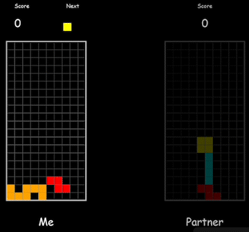

# TETRIS2023

## 사용방법

기본적으로 서버는 로컬서버에 22222번 포트 사용

1. server.py 실행
2. tetris.py에서 서버에 맞는 IP,PORT로 MySocket객체 생성하도록 하고 실행

## 코드참고

https://www.techwithtim.net/tutorials/game-development-with-python/tetris-pygame/tutorial-4/

## 할 일

- 코드정리
- 일회성이 아닌 연속으로 게임 진행
- 개인플레이, 멀티플레이 구분
- 전송 데이터를 최소화
- TETRIS2021의 드랍기능(SPACE 키)
